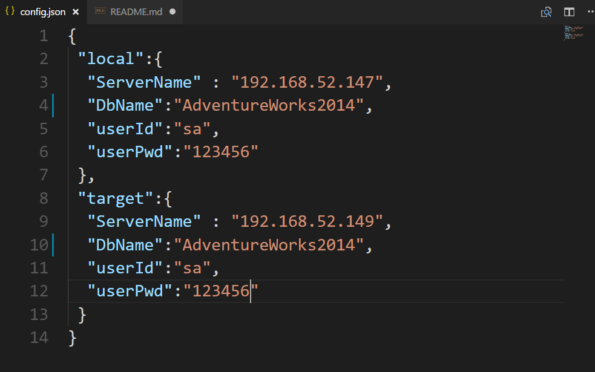
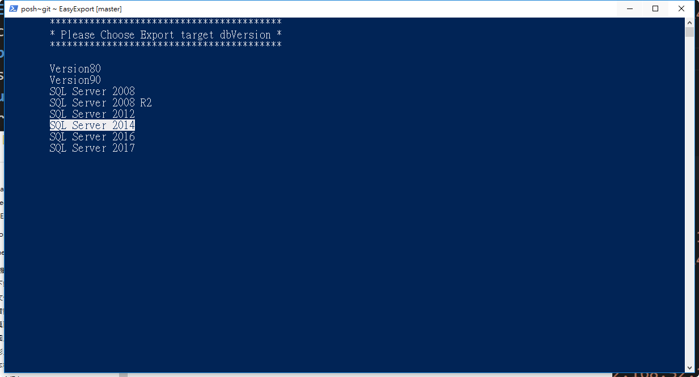
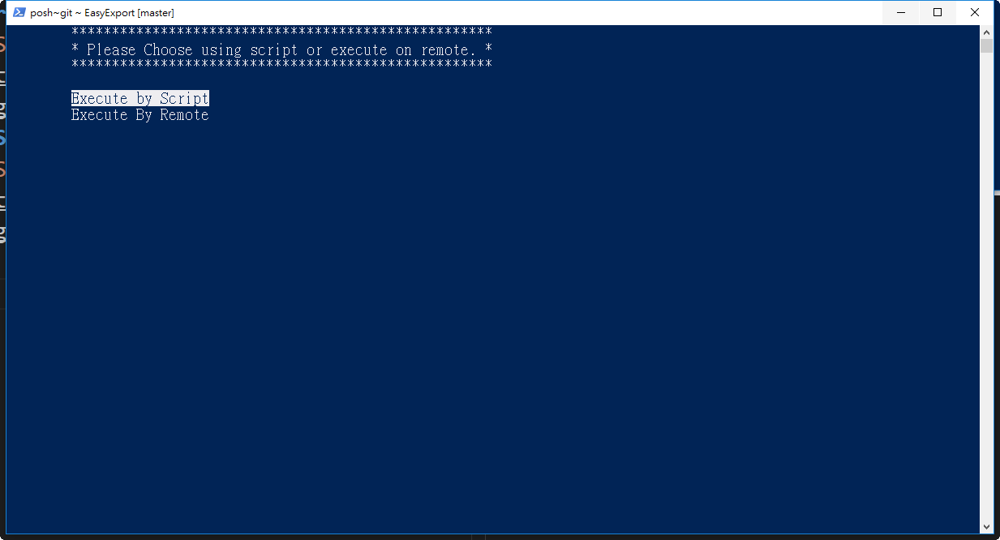

# EasyExport
EasyExport is for SQL Server transform New version to Old version script 
# A known issued
1. If source database has enable Temporal Tables. Transfer will fail . because the old version SQL Server unsupported
# Enviroment Requirement
Becuase this script will use **bcp** and **SMO**. You need install **SQL Server Management Studio** before start use this script 

# How to Use 
**Step 1. Setting config.json**

**Step 2. Execute script choose target SQL Server version**

**Step 3. Choose transfer method**
